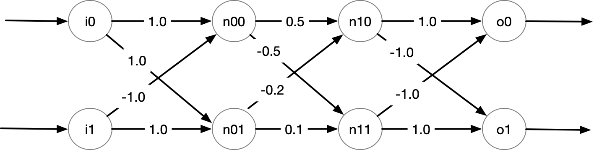

# CS695/SWE699: AI Safety and Assurance

# 8/22/2023 (first day of class)

## Syllabus

- AI Verification

- main website: https://nguyenthanhvuh.github.io/class-verification/

- Communication through Piazza
  - will send out invitations by this week

- No required book

- No final exam or quizzes

### Graded components

   - Reading assignments will give given weekly 
   - Discussions in class
  
- 3-4 programming assignments (may be done in group  <= 3)
  - Use Python, easiest for this kind ML! 

- 1 final assignment (may be done in group <=3)
  - Choose a verification technique (e.g., Reluplex)
    - by the 4th week of the class 
  - Learn it in depth (e.g., through reading, practice on papers, etc)
  - Create a small implementation for it
     - by Thanskgiving
  - Write about how it works in detail using a small example
      - write in Markdown and post to class Github repo
      - by the final week of the semester
  

## Lecture 1

### Motivation 

#### DNN Everywhere

 
 
 
 

#### DNN Problems
> Bias

 
 
 

> Safety

 


 

> Robustness


 


 


#### What Can We Do?
- Classical Software problem 
  - Finding a "counterexample (cex)" input that violate desired properties (e.g., network is robust)
  - E.g., for safety, robust, etc :  if cannot find cex, then the network is "safe", "robust", 

> Testing 

- If can find a cex, then the property is definitely violated
- Testing is widely-used
  - Pros: fast, can run on blackbox
  - Cons: doesn't show absense of bugs (pass testing does not mean software is really safe)

- NN: already has lots of trainning to achieve accuracy (e.g., lots of training for NNs used in Cars, Robots, etc)
  - and yet we see in the above examples they still have issues
  - Just like testing, can miss "corner" cases, e.g., missclassify image with small noise

> Verifying
- If cannot find, the property is definitely satisfied
- Verification is less-used, only in specific domain (why?)
  - Pros: provide proofs/guarantees.  Higher confidence. 
  - Cons: expensive, requires source code

- When do you want verification?

> Testing shows the existence of bug, not its absence (Dijkstra).
  
We mainly focus on verification in this class.

## SAT Solving using Z3

### DNN Verification

#### DNNs introduction

- Example: Feedforward Neural Network
 
  - Fully connected
  - Inputs/Output
  - Relu
    - apply to internal nodes: n00,n01,n10,n11
    - do not apply to output nodes o0, o1 
    - `y=max(x,0)`
    - Symbolic Representation
      - inputs: Reals i0, i1 
      - output: o0,o1
      - internal nodes:  n00 = If(i0+ -1*i1 <= 0, 0, i0 + -1*i1)

> DNN Representation      
```python
DNN = And(n0_0 == If(i0 + -1*i1 <= 0, 0, i0 + -1*i1),
     n0_1 == If(i0 + i1 <= 0, 0, i0 + i1),
     n1_0 ==
     If(1/2*n0_0 + -1/5*n0_1 <= 0, 0, 1/2*n0_0 + -1/5*n0_1),
     n1_1 ==
     If(-1/2*n0_0 + 1/10*n0_1 <= 0, 0, -1/2*n0_0 + 1/10*n0_1),
     o0 == n1_0 + -1*n1_1,
     o1 == -1*n1_0 + n1_1)
```
> Property Representation
- Precondition over inputs  => postcondition over outputs
  - If Pre then Post
- `If 1.0 >= i0 >= 0.0 and i1 <= 0.03 then o0 > o1`


> Verification as a SAT problem 
- DNN = logical formula representing network
- Pre = logical formulae representing precondition 
- Post = logical formula representing postcondition 

- DNN => (Pre => Post)  
  = (DNN & Pre) => Post
  = Not(DNN & Pre) or Post 
  = (Not(DNN & Pre) or Pos) is valid ?
  = (DNN & Pre) and !Post is UNSAT 


 We can use a constraint solver such as Z3 to query various things about this DNN from the obtained symbolic states:

1. Generating random inputs and obtain outputs
```python
    z3.solve(symbolic_states)
   [n0_1 = 15/2,
    o1 = 1/2,
    o0 = -1/2,
    i1 = 7/2,
    n1_1 = 1/2,
    n1_0 = 0,
    i0 = 4,
    n0_0 = 1/2]
```

2. Simultating a concrete execution

```python
    i0, i1, n0_0, n0_1, o0, o1 = z3.Reals("i0 i1 n0_0 n0_1 o0 o1")

    # finding outputs when inputs are fixed [i0 == 1, i1 == -1]
    g = z3.And([i0 == 1.0, i1 == -1.0])
    z3.solve(z3.And(symbolic_states, g))  # we get o0, o1 = 1, -1
    [n0_1 = 0,
    o1 = -1,
    o0 = 1,
    i1 = -1,
    n1_1 = 0,
    n1_0 = 1,
    i0 = 1,
    n0_0 = 2]
```

3. Checking assertions

   ```python
    print("Prove that if (n0_0 > 0.0 and n0_1 <= 0.0) then o0 > o1")
    g = z3.Implies(z3.And([n0_0 > 0.0, n0_1 <= 0.0]), o0 > o1)
    print(g)  # Implies(And(i0 - i1 > 0, i0 + i1 <= 0), o0 > o1)
    z3.prove(z3.Implies(symbolic_states, g))  # proved

    print("Prove that when (i0 - i1 > 0 and i0 + i1 <= 0), then o0 > o1")
    g = z3.Implies(z3.And([i0 - i1 > 0.0, i0 + i1 <= 0.0]), o0 > o1)
    print(g)  # Implies(And(i0 - i1 > 0, i0 + i1 <= 0), o0 > o1)
    z3.prove(z3.Implies(symbolic_states, g))
    # proved

    print("Disprove that when i0 - i1 >0, then o0 > o1")
    g = z3.Implies(i0 - i1 > 0.0, o0 > o1)
    print(g)  # Implies(And(i0 - i1 > 0, i0 + i1 <= 0), o0 > o1)
    z3.prove(z3.Implies(symbolic_states, g))
    # counterexample
    # [n0_1 = 15/2,
    # i1 = 7/2,
    # o0 = -1/2,
    # o1 = 1/2,
    # n1_0 = 0,
    # i0 = 4,
    # n1_1 = 1/2,
    # n0_0 = 1/2]
   ```


#### Property
- Example
- Pre => Post


### Verification  
- DNN => Prop

### SAT Solving

- implication 

- satisfiability 
  - f is satisfiable if exist assignment that makes f evaluate to true 


- f is valid iff !f is unsatisfiable 

  
### Symbolic Reasoning  


### SAT Solving 

### Basic Defs

- Deep Neural Networks
  - Architecture
    - FNN
    - RNN
    - CNN 
  - Weights/Bias/Parameters
  

### Desired Properties to Verify
- Robustness
- Safety
- Consistency

#### Connection to Software 


#### Techniques
##### Testing
- Adversarial Attacks

##### Verification
- 


### Encoding
#### Logical Formula and SAT solving


#### Encoding DNN Verification as Logical Formula
- Network
- Specification
- SAT problem


#### Z3 SMT solving demonstration 


#### Challenges
- Dealing with scalability, complex and large real-world networks
- Expressing and formalizing desired specification
